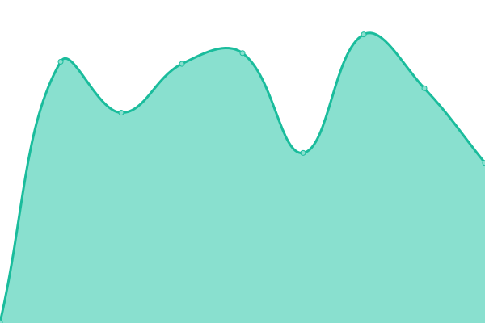

# [📈 Live Status](https://MDJ.github.io/karma-site-monitoring): <!--live status--> **🟧 Partial outage**

This repository contains the open-source uptime monitor and status page for [Dilip](https://MDJ.github.io/karma-site-monitoring), powered by [Upptime](https://github.com/upptime/upptime).

With [Upptime](https://upptime.js.org), you can get your own unlimited and free uptime monitor and status page, powered entirely by a GitHub repository. We use [Issues](https://github.com/MDJ/karma-site-monitoring/issues) as incident reports, [Actions](https://github.com/MDJ/karma-site-monitoring/actions) as uptime monitors, and [Pages](https://MDJ.github.io/karma-site-monitoring) for the status page.

<!--start: status pages-->
<!-- This summary is generated by Upptime (https://github.com/upptime/upptime) -->
<!-- Do not edit this manually, your changes will be overwritten -->
<!-- prettier-ignore -->
| URL | Status | History | Response Time | Uptime |
| --- | ------ | ------- | ------------- | ------ |
|  [QA-portal-Karma](https://staging.karmahealthcare.in/karma-app/staging/Login.html) | 🟥 Down | [qa-portal-karma.yml](https://github.com/MDJ/karma-site-monitoring/commits/HEAD/history/qa-portal-karma.yml) | 

 759ms
     
 | 

<a href="https://MDJ.github.io/karma-site-monitoring/history/qa-portal-karma">64.32%</a>
    

|  [Dev-portal-Karma](https://staging.karmahealthcare.in/karma-app/testing/Login.html) | 🟥 Down | [dev-portal-karma.yml](https://github.com/MDJ/karma-site-monitoring/commits/HEAD/history/dev-portal-karma.yml) | 

 286ms
     
 | 

<a href="https://MDJ.github.io/karma-site-monitoring/history/dev-portal-karma">64.35%</a>
    

|  [Prod-portal-Karma](https://karmahealthcare.in/karma-app/Management/Login.html) | 🟥 Down | [prod-portal-karma.yml](https://github.com/MDJ/karma-site-monitoring/commits/HEAD/history/prod-portal-karma.yml) | 

 700ms
     
 | 

<a href="https://MDJ.github.io/karma-site-monitoring/history/prod-portal-karma">62.77%</a>
    

|  [Staging-API-Karma](https://staging.api.karmaprimaryhealthcare.in) | 🟥 Down | [staging-api-karma.yml](https://github.com/MDJ/karma-site-monitoring/commits/HEAD/history/staging-api-karma.yml) | 

 688ms
     
 | 

<a href="https://MDJ.github.io/karma-site-monitoring/history/staging-api-karma">0.00%</a>
    

|  [Prod-API-Karma](https://api.karmaprimaryhealthcare.in/api/auth/password_login) | 🟥 Down | [prod-api-karma.yml](https://github.com/MDJ/karma-site-monitoring/commits/HEAD/history/prod-api-karma.yml) | 

 678ms
     
 | 

<a href="https://MDJ.github.io/karma-site-monitoring/history/prod-api-karma">0.00%</a>
    

|  [Prod-texttovid](https://texttovid.devkraft.in/api/health) | 🟩 Up | [prod-texttovid.yml](https://github.com/MDJ/karma-site-monitoring/commits/HEAD/history/prod-texttovid.yml) | 

 736ms
     
 | 

<a href="https://MDJ.github.io/karma-site-monitoring/history/prod-texttovid">100.00%</a>
    

|  [Prod-semantic](https://semantic.devkraft.in/api/health) | 🟩 Up | [prod-semantic.yml](https://github.com/MDJ/karma-site-monitoring/commits/HEAD/history/prod-semantic.yml) | 

 712ms
     
 | 

<a href="https://MDJ.github.io/karma-site-monitoring/history/prod-semantic">100.00%</a>
    

<!--end: status pages-->

[**Visit our status website →**](https://MDJ.github.io/karma-site-monitoring)

## 📄 License

- Powered by: [Upptime](https://github.com/upptime/upptime)
- Code: [MIT](./LICENSE) © [Dilip](https://MDJ.github.io/karma-site-monitoring)
- Data in the `./history` directory: [Open Database License](https://opendatacommons.org/licenses/odbl/1-0/)
